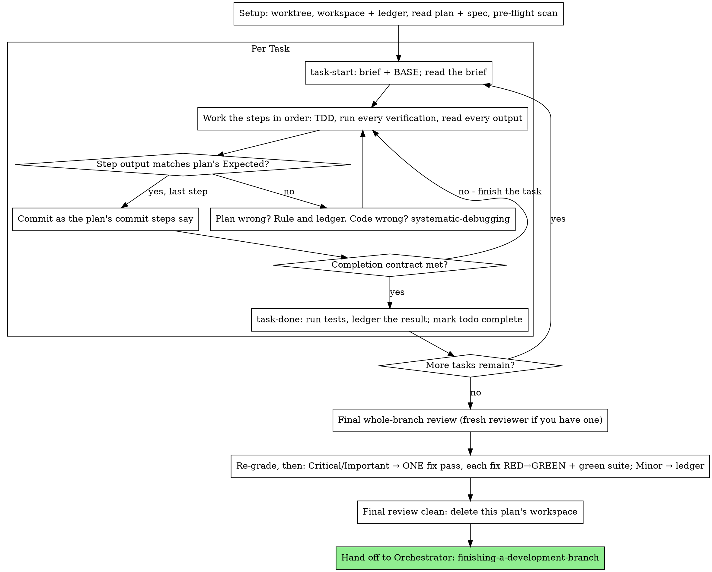

# Process Diagram (executing-plans)

Full per-task / whole-branch process graph. Read before starting Task 1, and again if you lose the thread after compaction.

```dot
digraph process {
    rankdir=TB;

    subgraph cluster_per_task {
        label="Per Task";
        "task-start: brief + BASE; read the brief" [shape=box];
        "Work the steps in order: TDD, run every verification, read every output" [shape=box];
        "Step output matches plan's Expected?" [shape=diamond];
        "Plan wrong? Rule and ledger. Code wrong? systematic-debugging" [shape=box];
        "Commit as the plan's commit steps say" [shape=box];
        "Completion contract met?" [shape=diamond];
        "task-done: run tests, ledger the result; mark todo complete" [shape=box];
    }

    "Setup: worktree, workspace + ledger, read plan + spec, pre-flight scan" [shape=box];
    "More tasks remain?" [shape=diamond];
    "Final whole-branch review (fresh reviewer if you have one)" [shape=box];
    "Re-grade, then: Critical/Important → ONE fix pass, each fix RED→GREEN + green suite; Minor → ledger" [shape=box];
    "Final review clean: delete this plan's workspace" [shape=box];
    "Hand off to Orchestrator: finishing-a-development-branch" [shape=box style=filled fillcolor=lightgreen];

    "Setup: worktree, workspace + ledger, read plan + spec, pre-flight scan" -> "task-start: brief + BASE; read the brief";
    "task-start: brief + BASE; read the brief" -> "Work the steps in order: TDD, run every verification, read every output";
    "Work the steps in order: TDD, run every verification, read every output" -> "Step output matches plan's Expected?";
    "Step output matches plan's Expected?" -> "Plan wrong? Rule and ledger. Code wrong? systematic-debugging" [label="no"];
    "Plan wrong? Rule and ledger. Code wrong? systematic-debugging" -> "Work the steps in order: TDD, run every verification, read every output";
    "Step output matches plan's Expected?" -> "Commit as the plan's commit steps say" [label="yes, last step"];
    "Commit as the plan's commit steps say" -> "Completion contract met?";
    "Completion contract met?" -> "Work the steps in order: TDD, run every verification, read every output" [label="no - finish the task"];
    "Completion contract met?" -> "task-done: run tests, ledger the result; mark todo complete" [label="yes"];
    "task-done: run tests, ledger the result; mark todo complete" -> "More tasks remain?";
    "More tasks remain?" -> "task-start: brief + BASE; read the brief" [label="yes"];
    "More tasks remain?" -> "Final whole-branch review (fresh reviewer if you have one)" [label="no"];
    "Final whole-branch review (fresh reviewer if you have one)" -> "Re-grade, then: Critical/Important → ONE fix pass, each fix RED→GREEN + green suite; Minor → ledger";
    "Re-grade, then: Critical/Important → ONE fix pass, each fix RED→GREEN + green suite; Minor → ledger" -> "Final review clean: delete this plan's workspace";
    "Final review clean: delete this plan's workspace" -> "Hand off to Orchestrator: finishing-a-development-branch";
}
```
